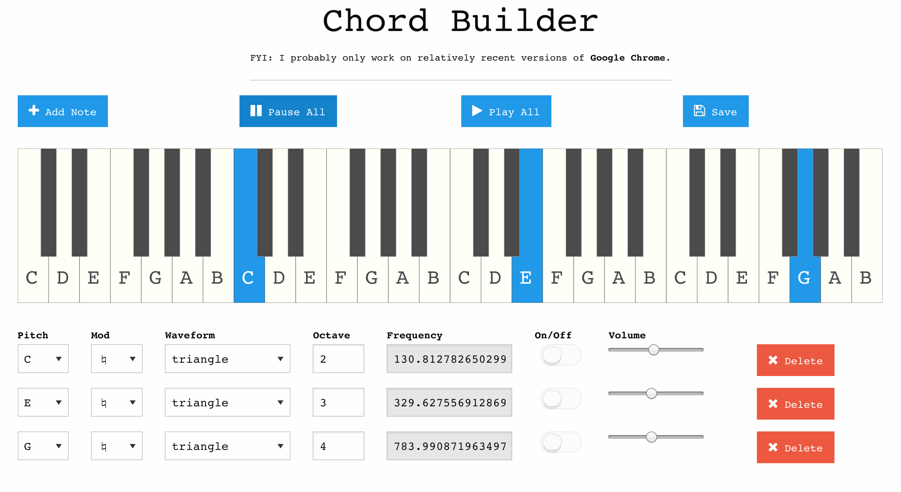
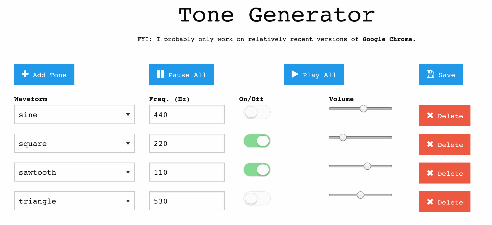

# Tones

This is a tone generator that uses the [Web Audio API](https://developer.mozilla.org/en-US/docs/Web/API/Web_Audio_API).

**NOTE:** *this only works in Chrome right now, no other browsers implement the Web Audio API yet.*

This site is deployed to Heroku:

[http://tone-generator.herokuapp.com/](http://tone-generator.herokuapp.com/)

There are two functions

## Chord Builder

## Tone Generator

